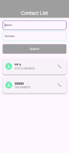

# Contact List Flutter App

A simple Flutter app to manage contacts. Users can add contacts (name and phone number), delete contacts with a long press, and get warnings if fields are incomplete.

---

## Features

- **Add Name and Contact:**Users can add a contact by entering a name and a phone number.
       


- **Long-Press to Delete:** Long pressing a contact in the list prompts the app to show a confirmation dialog for deletion.
  

- **Warning for Empty Fields:** If the user tries to submit the form with an empty name or phone number, a warning message appears at the bottom using `ScaffoldMessenger`.
  

- **Alert Dialog for Deletion Confirmation:** When deleting a contact, an alert dialog confirms the deletion.
  

---

## Getting Started

### Prerequisites

- Flutter SDK: [Installation Guide](https://flutter.dev/docs/get-started/install)
- Android Studio or Visual Studio Code (for Flutter development)
- An Android emulator or a physical device for testing

### Clone the repository

```bash
git clone https://github.com/your-username/contactListFlutterApp.git
